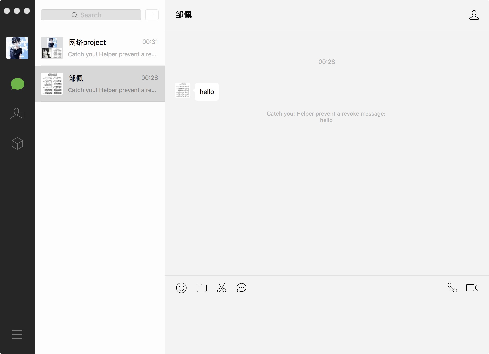
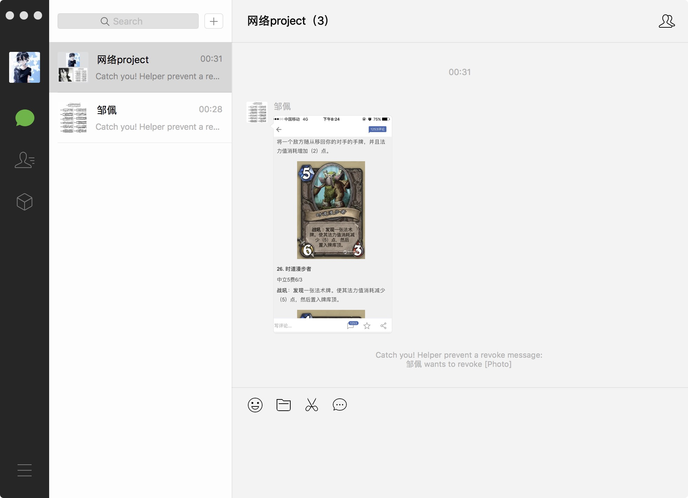
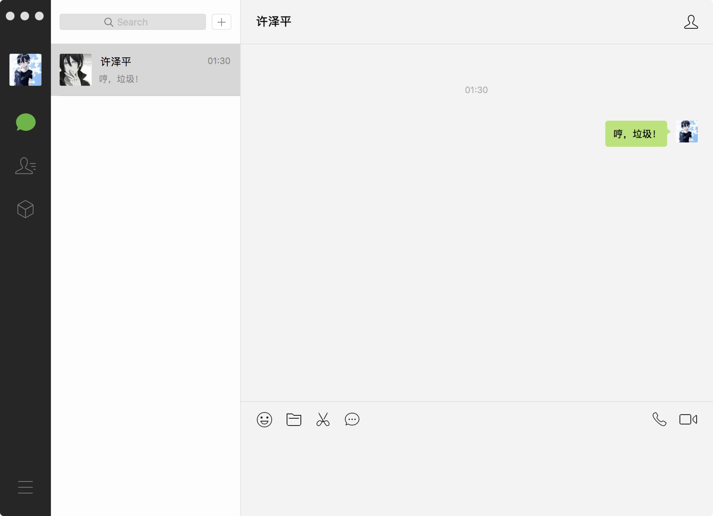
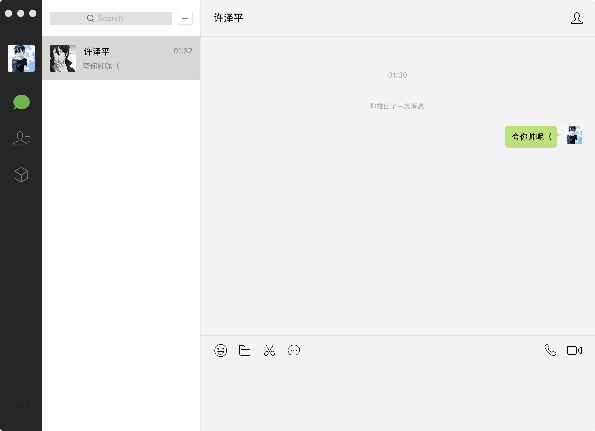
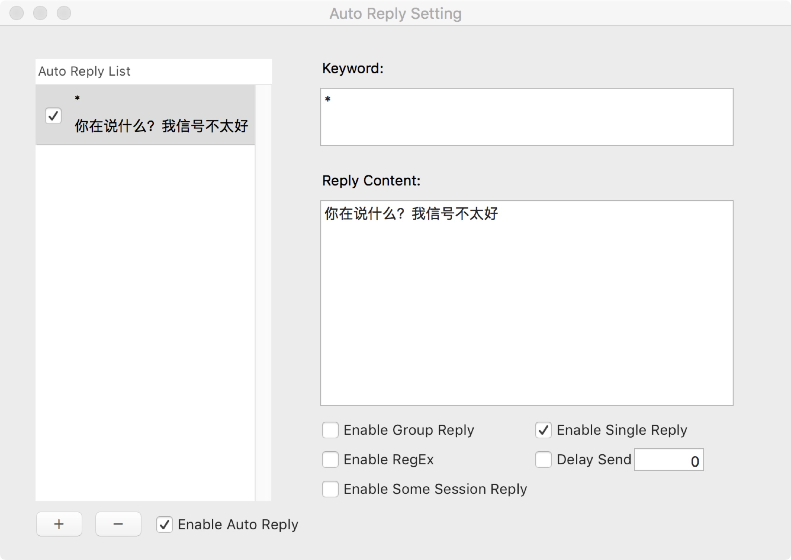

# 微信小助手

## 简介

​    下载地址: [DMG 文件](https://github.com/W4anD0eR96/WeChatHelper/releases/download/untagged-aa1673ad6a2eb3fcd981/WeChatHelper.dmg)

​    微信小助手是一款 Mac OS X 上的微信增强软件, 下载 dmg 文件后打开, 运行其中的 INSTALL 文件即可安装，安装后随时可运行 UNINSTALL 文件卸载, 整个过程非常简单

​    运行 INSTALL 或 UNINSTALL 文件时可能由于下载源于网上, 需要您手动确认运行, 在系统偏好设置的安全性选项中手动确认运行即可

​    安装过程需要修改微信可执行文件, 系统可能提示需要输入密码, 根据提示输入密码即可

## 功能介绍

微信小助手主要包括四项功能, 均在顶栏的微信小助手选项卡中选择

微信小助手根据电脑设置的地区, 对简体中文, 正体中文和英文做了本地化处理, 在上图中显示的选项卡为 Assistant, 在简体中文下显示选项卡为微信小助手

### 消息防撤回

再也不用因为看不到别人撤回的消息烦恼啦! 通过点击微信小助手下拉菜单中的 开启消息防撤回(Prevent Revoke) 选项启用, 快捷键 cmd+T, 可以拦截个人对话和群聊中的所有撤回信息: 哼哼, 统统不许跑! 不过自己撤回自己发送的信息当然是一律通行啦, 我不想让你看, 还想咋地

### 登录免验证

微信小助手提供的登录免验证指的是在打开微信时, 无需扫码或手机确认登陆信息, 直接登陆进入上次登陆的微信账号, 这一功能通过 免认证登录(Auto Login) 选项启用, 快捷键 cmd+L

由于技术上的是打开上次登陆的账号, 所以在安装小助手后的第一次登录仍然需要验证, 但是此后的登录就不需要再依靠手机啦

### 窗口总在最前

这一功能通过 微信窗口置顶(Sticky on Top) 选项启用, 快捷键 cmd+shift+D, 如同其名，在切换操作不同窗口时, 总保证微信窗口在最前面, 这样就能随时看到微信接收到的消息啦

### 消息自动回复

这一功能通过 自动回复设置(Auto Reply Settings) 选项打开自动回复的设置界面, 快捷键 cmd+K

自动回复支持丰富的定制:

通过左下角的 + - 符号可以增加或删除自动回复的模式, 点击 开启自动回复(Enable Auto Reply) 即可启用自动回复功能

右侧 关键字(Keyword) 框内填写触发自动回复的内容, 支持完全的文本匹配, 也可开启正则表达式功能编写正则表达式; 回复内容(Reply Content) 框填写自动回复的回复文本, 可以用 `|` 隔开多端文本, 自动回复时随机选一段回复

可以定制自动回复的对象, 开启群聊自动回复(Enable Group Reply)使得该自动回复模式在所有群聊中生效, 对应的, 开启私聊自动回复(Enable Single Reply)使得该自动回复模式在所有私聊中生效, 开启特定回复(Enable Some Seesion Reply)可以在弹出的选择框里选择对话, 使得只在指定对话中启用该自动回复模式

## 问题反馈及开发相关

微信小助手的开发会同步到 [GitHub 仓库](https://github.com/W4anD0eR96/WeChatHelper)上, 开发者可以点击跳转到网址自行 Fork 开发

微信小助手使用过程中遇到的问题也可反馈到 GitHub 页面上的 issue 板块中